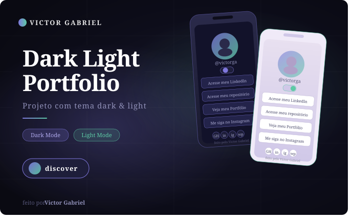

# 🌙 Dark Light Portfolio



Um projeto de portfólio/linktree responsivo desenvolvido com HTML, CSS e JavaScript, contendo modo claro e escuro, animações suaves e integração com redes sociais.

---

## 🚀 Tecnologias utilizadas

- HTML5
- CSS3
- JavaScript
- Figma
- Git & GitHub

---

## 🎨 Funcionalidades

✅ Modo claro e escuro  
✅ Layout responsivo  
✅ Botão interativo de troca de tema  
✅ Links personalizados  
✅ Ícones sociais  
✅ Background dinâmico  
✅ Design moderno inspirado no Figma

---

## 📱 Preview

Projeto desenvolvido com foco em prática de:
- Flexbox
- Variáveis CSS
- Manipulação do DOM
- Responsividade
- UI/UX

---

## 🛠️ Aprendizados

Durante esse projeto pratiquei:
- Estruturação HTML semântica
- Organização de CSS
- Uso de variáveis no `:root`
- Manipulação de classes com JavaScript
- Posicionamento com Flexbox
- Criação de temas Dark/Light

---

## 📂 Como executar o projeto

```bash
# Clone este repositório
git clone https://github.com/seu-usuario/dark-light-portfolio.git